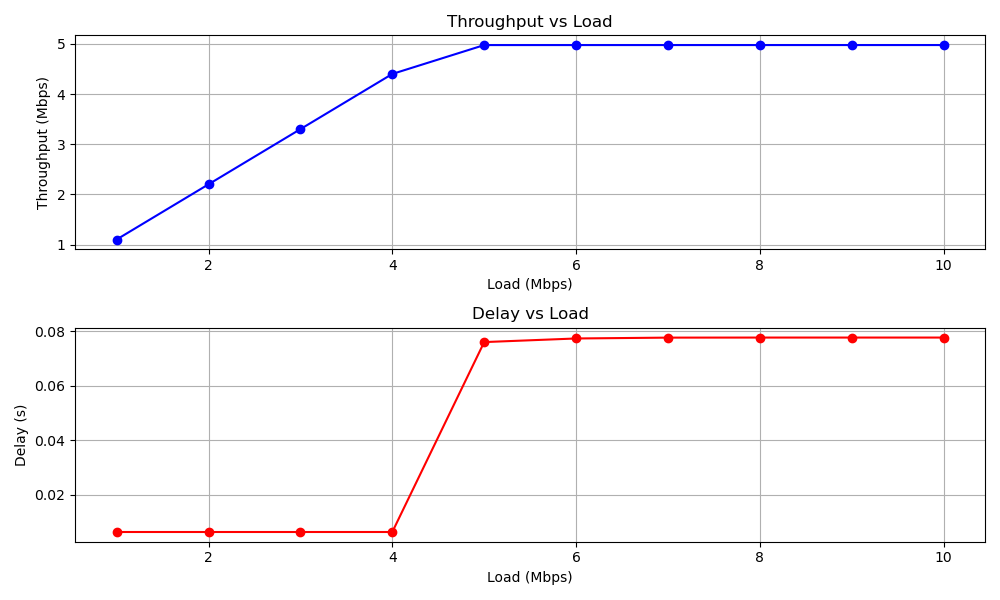
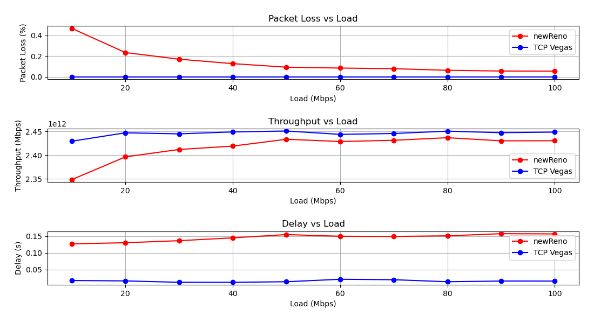

# NS-3 Simulation and Analysis Project

This project runs NS-3 simulations for two parts, `PartA` and `PartB`, and generates analysis graphs using a Python script.

## Prerequisites

Ensure you have the following installed on your system:
- **NS-3**: Network Simulator 3
- **Python 3**: Required for the analysis script
- **Matplotlib**: A Python library for generating graphs (`pip install matplotlib`)

## Directory Structure

The project uses the following directory structure:
- `pcaps/`: Stores `.pcap` files generated from simulations.
- `graphs/`: Stores analysis graphs generated by the Python script.

## Files

- **`partA.cc`**: NS-3 simulation code for PartA.
- **`partB.cc`**: NS-3 simulation code for PartB.
- **`analyze.py`**: Python script to analyze simulation data and generate graphs.
- **`Makefile`**: Build and execution automation.

## Usage

### Build and Run Simulations

To build and run simulations for `PartA` and `PartB`, and to perform analysis, use the following commands:

1. **Run all tasks:**
   ```bash
   make all
## Results




